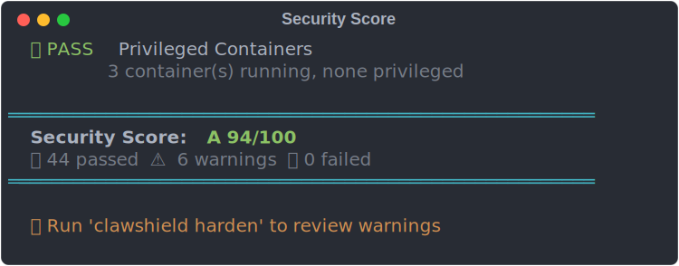

<p align="center">
  
</p>

<h1 align="center">ClawShield 🛡️</h1>

<p align="center">
  <strong>Security Layer for AI Agents — One binary. Zero config. 50 checks.</strong>
</p>

<p align="center">
  <a href="#-quick-start"></a>
  
  
  
  
</p>

---

## The Problem

AI agents run with **powerful permissions** — root access, API keys, network access, tool execution. A misconfigured server or a malicious skill can compromise everything.

**ClawShield** scans your system in seconds and tells you exactly what's wrong and how to fix it.

---

## ⚡ Quick Start

```bash
# Option 1: Install via OpenClaw Skill (recommended)
clawhub install clawshield

# Option 2: Install standalone (Linux/macOS)
curl -fsSL https://raw.githubusercontent.com/lennystepn-hue/clawshield/main/scripts/install.sh | bash

# Run your first scan
clawshield scan
```

That's it. **Full security report in under 5 seconds.**

---

## 🔍 Security Scanner — 50 Checks

ClawShield runs **50 automated security checks** across 5 categories:

### Network (7 checks)
| Check | What it does |
|:------|:-------------|
| UFW Firewall | Verifies firewall is active with rules configured |
| Open Ports | Detects dangerous ports (MySQL, Redis, MongoDB, etc.) |
| IPv6 | Flags unnecessary IPv6 attack surface |
| DNS Configuration | Validates nameserver configuration |
| Binding Audit | Finds internal services bound to 0.0.0.0 |
| TLS Certificate Expiry | Warns about certificates expiring within 30 days |
| Tailscale | Checks VPN connectivity status |

### Access (11 checks)
| Check | What it does |
|:------|:-------------|
| SSH Root Login | Detects unrestricted root access |
| SSH Password Auth | Flags password-based login (should be key-only) |
| Fail2Ban | Verifies brute-force protection is active |
| SSH Port | Checks for default port with no protection |
| SSH Authorized Keys | Validates key file permissions |
| Login History | Flags password-based logins (key-based = OK) |
| Password Policy | Checks PAM complexity requirements |
| Inactive Users | Finds accounts inactive for 90+ days |
| UID Zero | Detects non-root accounts with UID 0 |
| Empty Passwords | Finds accounts without passwords |
| SSH Idle Timeout | Checks for session timeout configuration |

### System (13 checks)
| Check | What it does |
|:------|:-------------|
| Automatic Updates | Verifies unattended-upgrades is active |
| Kernel Version | Detects pending kernel updates |
| Disk Usage | Warns at 75%+, fails at 90%+ |
| Swap Usage | Monitors swap pressure |
| RAM Usage | Flags high memory consumption |
| CPU Load | Detects overloaded systems |
| Zombie Processes | Finds defunct processes |
| NTP Sync | Verifies system clock synchronization |
| AppArmor | Checks mandatory access control |
| Pending Updates | Counts outstanding package updates |
| Open FD Limit | Validates file descriptor limits |
| Core Dumps | Ensures core dumps don't leak to disk |
| Secure Boot | Reports Secure Boot status |

### Files (10 checks)
| Check | What it does |
|:------|:-------------|
| /etc/shadow Perms | Validates password file permissions |
| /tmp Sticky Bit | Ensures shared temp directory security |
| SUID Binaries | Detects unexpected setuid programs |
| World-Writable Dirs | Finds insecure directory permissions |
| Crontab Audit | Scans for suspicious cron patterns |
| Unowned Files | Finds files without valid owners |
| Large Files in /tmp | Detects potential data staging |
| Log Rotation | Verifies logrotate is configured |
| Backup Tools | Checks for backup infrastructure |
| API Keys in Files | Scans workspace for leaked credentials |

### Agent Security (9 checks)
| Check | What it does |
|:------|:-------------|
| Workspace Perms | Validates AI workspace permissions |
| .env Exposure | Finds exposed environment files |
| Docker Socket | Checks Docker socket permissions |
| OpenClaw Config | Validates config file permissions |
| API Keys in Env | Scans environment for leaked secrets |
| Skill Integrity | Checks for unsigned/modified skills |
| OpenClaw Version | Reports current agent version |
| Memory Limit | Verifies cgroup memory constraints |
| Privileged Containers | Detects Docker containers running privileged |

---

## 📊 Security Score

ClawShield grades your system from **A+** to **F**:

| Grade | Score | Meaning |
|:------|:------|:--------|
| **A+** | 95-100 | Excellent — production ready |
| **A** | 90-94 | Great — minor improvements possible |
| **B** | 80-89 | Good — some issues to address |
| **C** | 70-79 | Fair — several vulnerabilities |
| **D** | 60-69 | Poor — significant risks |
| **F** | 0-59 | Critical — immediate action required |

---

## 🔧 Commands

### `clawshield scan`

Run a full security audit with all 50 checks.

```
$ clawshield scan

    ________               _____ __    _      __    __
   / ____/ /___ __      __/ ___// /_  (_)__  / /___/ /
  / /   / / __ `/ | /| / /\__ \/ __ \/ / _ \/ / __  /
 / /___/ / /_/ /| |/ |/ /___/ / / / / /  __/ / /_/ /
 \____/_/\__,_/ |__/|__//____/_/ /_/_/\___/_/\__,_/
                                                v0.1.0
  🛡️  Security Layer for AI Agents

  🔍 Running security scan...
  ══════════════════════════════════════════════════════
    Security Score: A 93/100
    ✅ 43 passed  ⚠️  7 warnings  ❌ 0 failed
  ══════════════════════════════════════════════════════
```

### `clawshield harden`

Interactive hardening — walks you through every fixable issue with **detailed explanations**.

```
  ┌─ ⚠️ Password Policy [1/1]
  │  Risk: MEDIUM
  │
  │  Problem: No password complexity requirements. Users can set weak
  │           passwords like '123456'.
  │  Fix:     Installs pam_pwquality and enforces minimum 12-character
  │           passwords.
  │  Risk:    Existing passwords aren't affected. Only new password
  │           changes must meet the policy.
  │
  └─ Apply? [y/N]
```

Each fix shows:
- **Problem** — What's wrong and why it matters
- **Fix** — Exactly what will be changed
- **Risk** — What could go wrong (honest assessment)

Already-hardened checks are automatically skipped.

### `clawshield harden --auto`

Auto-fix all **low-risk** issues without prompting. Medium and high-risk fixes require interactive confirmation.

```bash
$ clawshield harden --auto

🔒 ClawShield Auto-Hardening
━━━━━━━━━━━━━━━━━━━━━━━━━━━━

📡 Scanning system first...
  ✅ No low-risk fixes needed — system looks good!
```

### `clawshield skill-scan [path]`

Scan skills for **malicious code patterns** — reverse shells, data exfiltration, credential theft, privilege escalation, and 40+ more threat patterns.

```
  ━━━ my-community-skill ━━━
  🔬 Skill Security Scan
  Path: ./skills/my-community-skill

  ✅ No security issues found

  Verdict: SAFE ✅
  Findings: 0 total
```

```bash
# Scan a single skill
clawshield skill-scan ./skills/some-community-skill

# Scan ALL installed skills (auto-detect)
clawshield skill-scan
```

### `clawshield monitor`

**Live security monitoring** — watches auth logs, network connections, processes, and more in real-time.

```bash
$ clawshield monitor

👁️  Live Security Monitor
  Watching: auth.log, connections, processes...
  [17:01:23] ⚠️  Failed SSH login from 92.118.39.87 (user: admin)
  [17:01:24] ✅ SSH key login from 100.79.101.58 (user: root)
  [17:01:30] ⚠️  New listening port: 8080 (pid: 12345)
```

---

## 🤖 Built for OpenClaw

ClawShield is designed as the **security layer** for [OpenClaw](https://github.com/openclaw/openclaw) — the open platform for AI agents.

```bash
# Install as OpenClaw skill
clawhub install clawshield

# Your agent can now run security scans
clawshield scan
```

**Why agents need security:**
- Skills from the community may contain **malicious code**
- Agents run with **elevated permissions** (often root)
- API keys and secrets are **everywhere** in agent configs
- Docker containers can **bypass your firewall**
- A compromised agent has access to **everything**

ClawShield monitors all of this. Automatically. Continuously.

---

## 🏗️ Architecture

```
clawshield/
├── cmd/clawshield/main.go      # CLI entry point
├── internal/
│   ├── scanner/
│   │   ├── scanner.go          # 50 security checks
│   │   └── report.go           # Terminal report formatting
│   ├── hardener/
│   │   └── hardener.go         # Scan-driven interactive hardener
│   ├── monitor/
│   │   └── monitor.go          # Live security monitoring
│   └── skills/
│       └── scanner.go          # Skill malicious code detection
├── scripts/
│   └── install.sh              # One-line installer
└── dist/                       # Cross-compiled binaries
    ├── clawshield-linux-amd64
    ├── clawshield-macos-amd64
    ├── clawshield-macos-arm64
    └── clawshield-windows-amd64.exe
```

**Single binary. No dependencies. No config files. No daemon.**

---

## 📦 Installation

### Linux / macOS (one-liner)
```bash
curl -fsSL https://raw.githubusercontent.com/lennystepn-hue/clawshield/main/scripts/install.sh | bash
```

### OpenClaw Skill
```bash
clawhub install clawshield
```

### Manual Download
Download the binary for your platform from [Releases](https://github.com/lennystepn-hue/clawshield/releases):

| Platform | Binary |
|:---------|:-------|
| Linux x86_64 | `clawshield-linux-amd64` |
| macOS Intel | `clawshield-macos-amd64` |
| macOS Apple Silicon | `clawshield-macos-arm64` |
| Windows | `clawshield-windows-amd64.exe` |

```bash
chmod +x clawshield-*
sudo mv clawshield-* /usr/local/bin/clawshield
```

### Build from Source
```bash
git clone https://github.com/lennystepn-hue/clawshield.git
cd clawshield
go build -o clawshield ./cmd/clawshield/
sudo mv clawshield /usr/local/bin/
```

---

## 🆚 Why ClawShield?

| | ClawShield | Manual Auditing | Other Tools |
|:--|:-----------|:----------------|:------------|
| Setup time | **30 seconds** | Hours | Minutes-Hours |
| Checks performed | **50+ automated** | Whatever you remember | Varies |
| Agent-aware | **Yes** — skills, configs, Docker | No | No |
| Fix guidance | **Interactive with risk levels** | Google it | Some |
| Skill vetting | **40+ threat patterns** | Read every file yourself | No |
| Single binary | **Yes, ~3MB** | N/A | Usually complex |
| Price | **Free & open source** | Your time | $$$+ |

---

## 🗺️ Roadmap

- [x] **v0.1** — Core Scanner & Hardener (50 checks)
- [x] **v0.3** — Agent Behavior Analysis, Live Monitor, Skill Scanner
- [ ] **v0.4** — Multi-host dashboard, threat intelligence feed
- [ ] **v1.0** — SaaS dashboard, team management, compliance reports

---

## 🤝 Contributing

Contributions welcome! See [CONTRIBUTING.md](CONTRIBUTING.md) for guidelines.

```bash
# Run tests
go test ./...

# Build
go build -o clawshield ./cmd/clawshield/

# Cross-compile
GOOS=linux GOARCH=amd64 go build -o dist/clawshield-linux-amd64 ./cmd/clawshield/
```

---

## 📄 License

MIT — see [LICENSE](LICENSE) for details.

---

<p align="center">
  Built with 🛡️ by the <a href="https://github.com/openclaw/openclaw">OpenClaw</a> community
</p>
